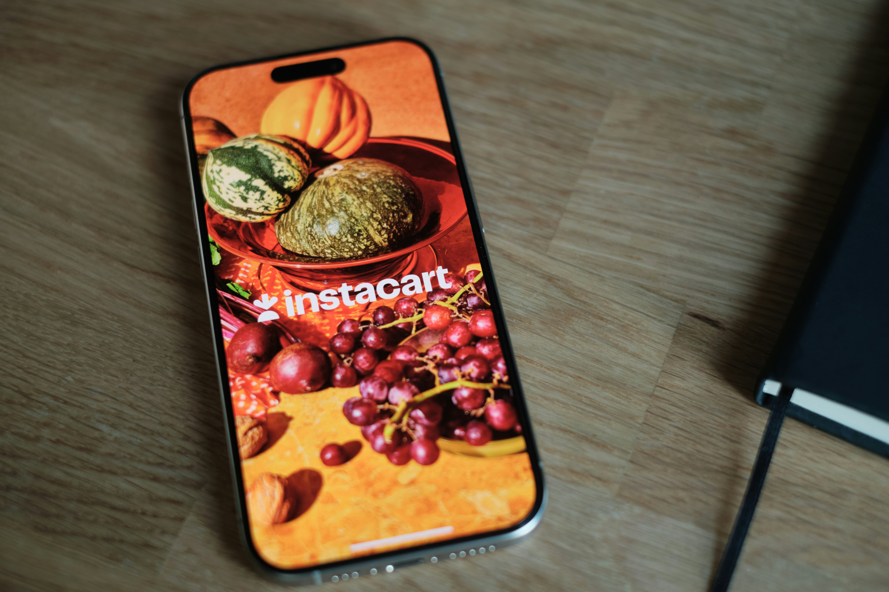
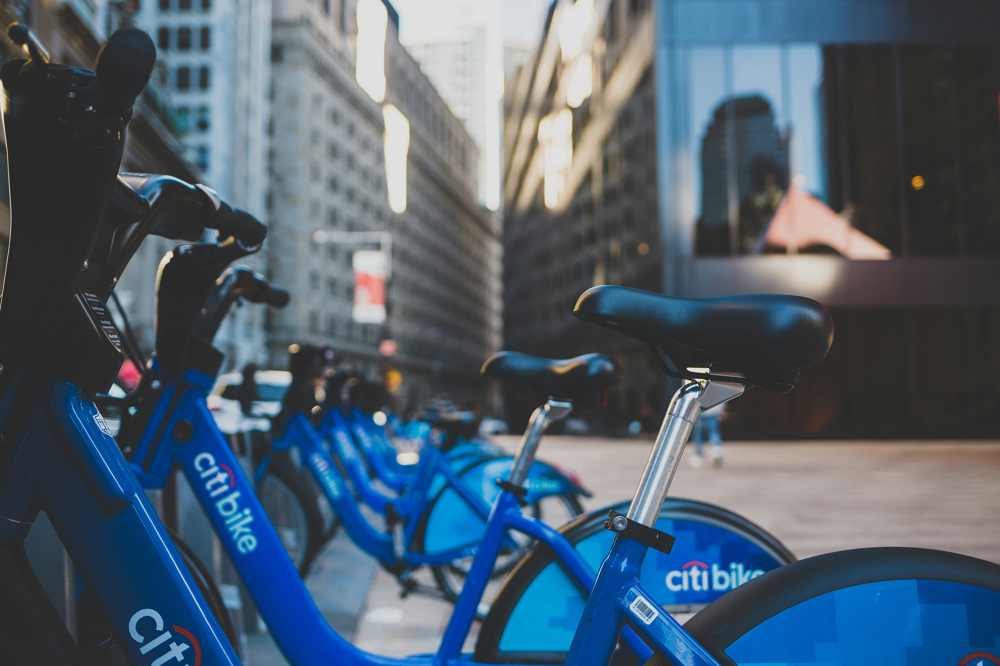

<!-- Hide the navigation bar -->

# Welcome to My Portfolio

---

## About Me

  
  

    Hi! I'm Lisa, a Data Analyst based out of Colorado who is passionate about turning data into actionable insights. I work with Python, SQL, Tableau, and more to help clients make sense of their data. This site showcases some of my recent projects. My background includes working across many domains, from healthcare to education, that gives me a wide lense of experience to pull from in my analyses.  
    I'm an avid traveler and absolutely love working in cross-cultural contexts. As a former resident of Spain I'm a lifelong Spanish learner. When I'm not working I can be found exploring the mountains via rock climbing, biking, or running. 
  

---

## Projects

  

    
    <h3><a href="https://github.com/lgreer929/Python-Sample" style="color: #004d66; text-decoration: none;">Sales and Customer Analysis</a></h3>
    
Utilized Python to clean, wrangle, analyze, and visualize data for Instacart sales trends.

    <a href="assets/project1.pdf" style="color: #990099;">Download Case Study Here</a>
  

  

    
    <h3><a href="https://github.com/lgreer929/Citi_Bike" style="color: #004d66; text-decoration: none;">Customer Usage Analysis</a></h3>
    
Analysis of seasonal and user trends in Python to evalute product demand.

    <a href="assets/project2.pdf" style="color: #990099;">Download Case Study Here</a>
  

  

    
    <h3><a href="https://github.com/lgreer929/USA-Real-Estate-Market" style="color: #004d66; text-decoration: none;">Trends in the US Housing Market</a></h3>
    
K-means clustering in Python to identify factors in housing costs.

    <a href="assets/project3.pdf" style="color: #990099;">Download Case Study Here</a>
  

---

## Resume

  You can download my resume here:  
  <a href="assets/resume.pdf" style="color: #004d66; font-weight: bold;">Resume (PDF)</a>

---

## Contact Me

<form action="mailto:lisa.greer@comcast.net" method="post" enctype="text/plain">
  <label for="name" style="display:block; margin-bottom:5px;">Name:</label>
  <input type="text" name="name" style="width:25%; padding:10px; margin-bottom:15px; border-radius:5px; border:1px solid #ccc;">

  <label for="email" style="display:block; margin-bottom:5px;">Email:</label>
  <input type="email" name="email" style="width:25%; padding:10px; margin-bottom:15px; border-radius:5px; border:1px solid #ccc;">

  <label for="message" style="display:block; margin-bottom:5px;">Message:</label>
  <textarea name="message" rows="6" style="width:25%; padding:10px; margin-bottom:15px; border-radius:5px; border:1px solid #ccc;"></textarea>

  <button type="submit" style="background-color:#004d66; color:white; border:none; padding:10px 20px; font-size:16px; border-radius:5px; cursor:pointer;">
    Submit
  </button>
</form>
